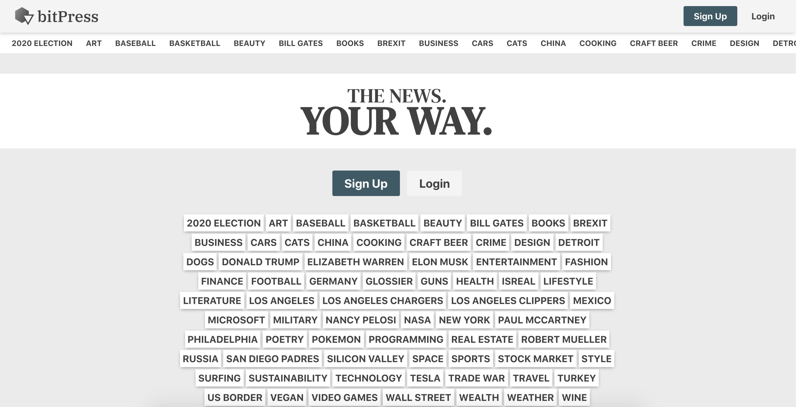
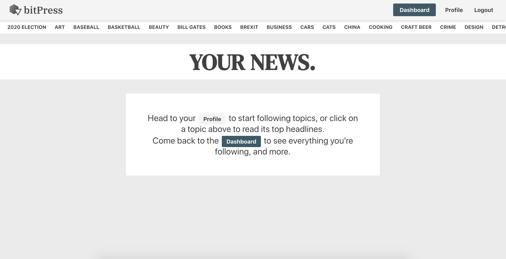
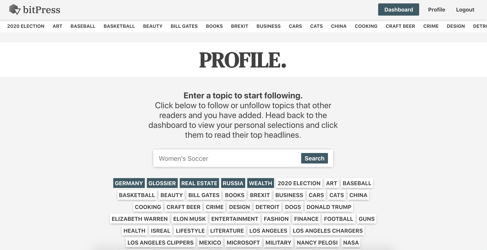
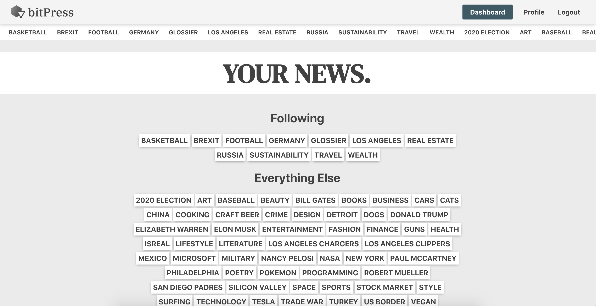

# bitPress - The News. Your way.

<a href="https://bitpress-client.herokuapp.com/">bitPress - Link to Live Site</a> 

This app allows you to customize the news to your interests. 

### bitPress Demo

Users are directed to a landing page which invites them to sign-up or login:

  
Demo Account Info:

  
Email: demo@email.com

  
Password: Demo123

<h1 align="center">
  
</h1>

Once logged in, the user is sent to their personal news dashboard:

<h1 align="center">
  
</h1>

If there aren't any news topics selected, they'll be directed to the Profile page where they can select topics (and create new ones) that they'll want to follow.

<h1 align="center">
  
</h1>

Returning to the dashboard, the user can now see the topics their following, along with everything else. 

<h1 align="center">
  
</h1>

The user can then navigate to the topic they want to read about by clicking on the topic:

<h1 align="center">
  
</h1>

### Database

This app uses Google Firebase and Firestore to handle all authentication and database functions. 

### Technologies
* ReactJS with Hooks
* Sass/SCSS
* Google Firebase/Firestore
* Continuous Integration with TravisCI
* Auto-deployment with Heroku
* Testing with Jest/Enzyme
